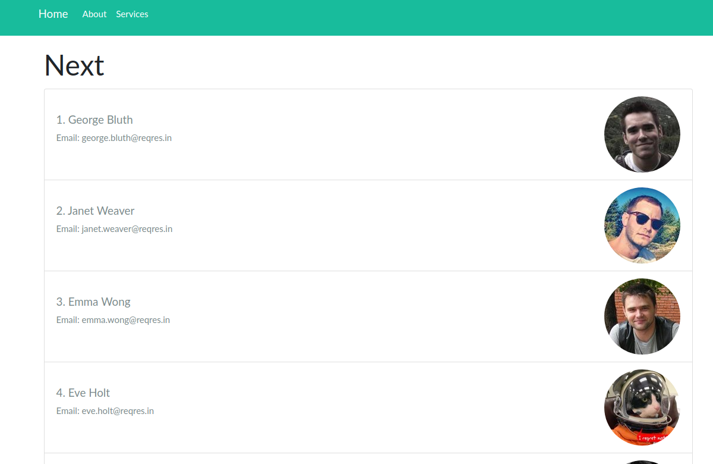

# Screenshot
  <li>

  <ul>
   • instalar dependencias: yarn install 
  </ul>
    <ul>
    • correr en dev:  yarn run dev 
  </ul>
    <ul>
    • convertir codigo:  yarn build
  </ul>
    <ul>
    • correr codigo convertido: yarn start
  </ul>

</li>

# Resources
* [Dynamic Routes](https://nextjs.org/docs/routing/dynamic-routes)
* [getInitialProps](https://nextjs.org/docs/api-reference/data-fetching/getInitialProps)
